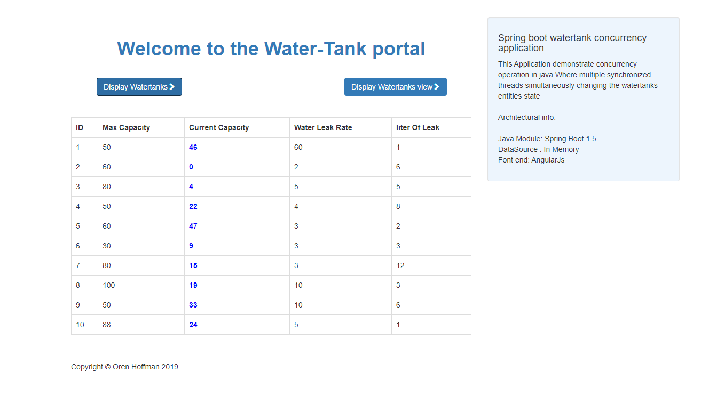

# spring-boot-concurrency-demo

Spring boot watertank concurrency application.

This Application demonstrate concurrency operation in java Where multiple synchronized threads simultaneously changing the watertanks entities state.

SPRING BOOT - CONCURRENCY DEMO APP :#Spring Boot, #In memory data, #Maven, #AngularJs, #HTML

To access the application run project as a spring boot app
and this endpoint http://localhost:8080 in the browser

## Images

@For any questions you can send an email to orenhoffman1777@gmail.com

